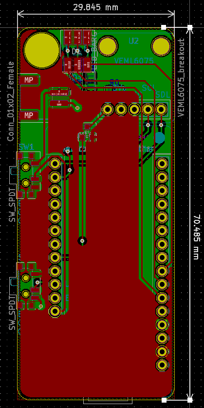
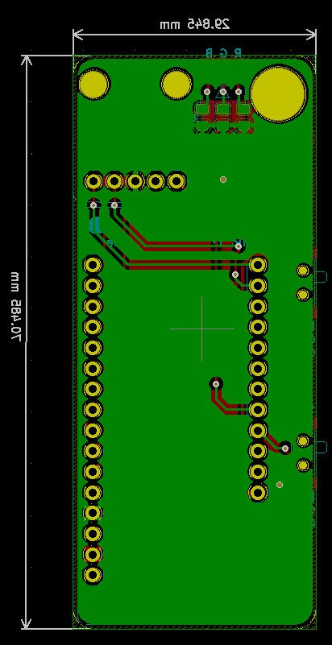

# Hardware

## Schematic

View the [schematic](images/schematic.pdf) and [footprint layout](images/footprint.pdf) in PDF format.

## Main components

1. nRF52 Bluefruit Feather Adafruit Breakout board
1. VEML6075 UV Index sensor Adafruit breakout board
1. RGB LED
1. LiPo

## Footprint

Front

Back

