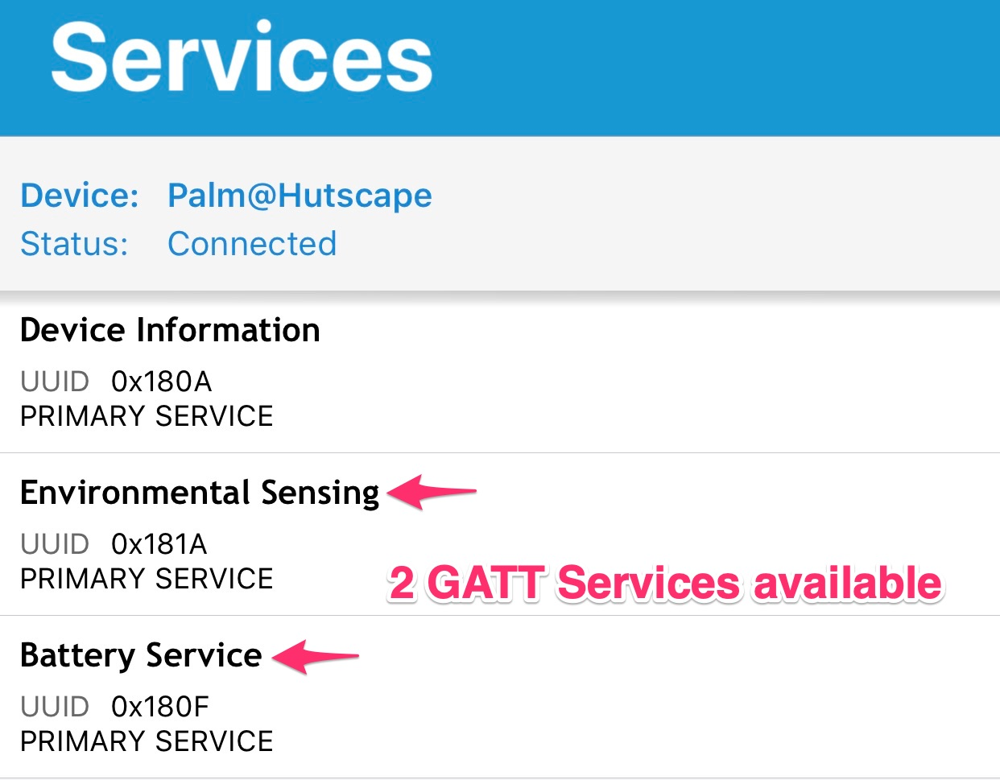

<section class="section is-small">
  

    <h2 class="title is-1">Getting Started</h2>
    

      

        

          

            <article class="tile is-child notification">
              
Step 1

              
Wire up the hardware components with <a href="">nRF52 Adafruit feather board</a>, <a href="https://www.adafruit.com/product/3964">VEML6075 sensor board</a> and LiPo battery. Turn on the switch for power and BLE.

              
              
            </article>
          

          

            <article class="tile is-child notification">
              
Step 2

              
Flash the firmware onto the <code>nRF52</code> board to display UV Index and battery level.

              
            </article>
          

          

            <article class="tile is-child notification">
              

                
Step 3

                
See the UV and battery level values on the <a href="https://itunes.apple.com/sg/app/nrf-connect/id1054362403?mt=8">nRF Connect iPhone app</a>

                
                  
                
              

            </article>
          

        

      

    

  

</section>

<section class="section is-small">
  

    <h2 class="title is-1">Maintenance</h2>
    

      <ul>
        <li><strong>Flashing firmware:</strong> Plug in the USB cable into the USB connector</li>
        <li><strong>Charging the LiPo:</strong> Plug in the USB cable into the USB connector. Charging will have the yellow LED on.</li>
      </ul>
    

  

</section>
