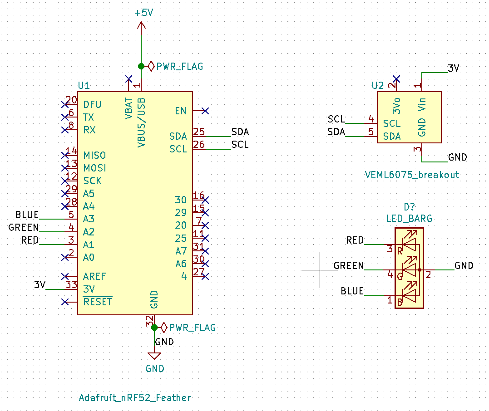
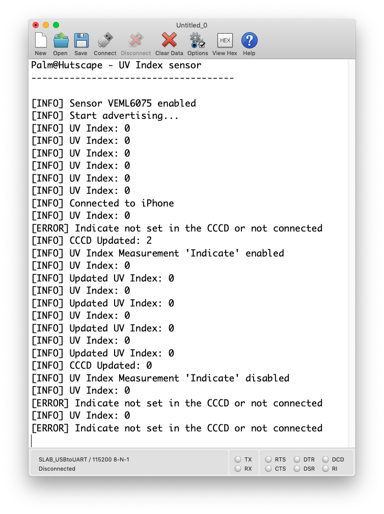
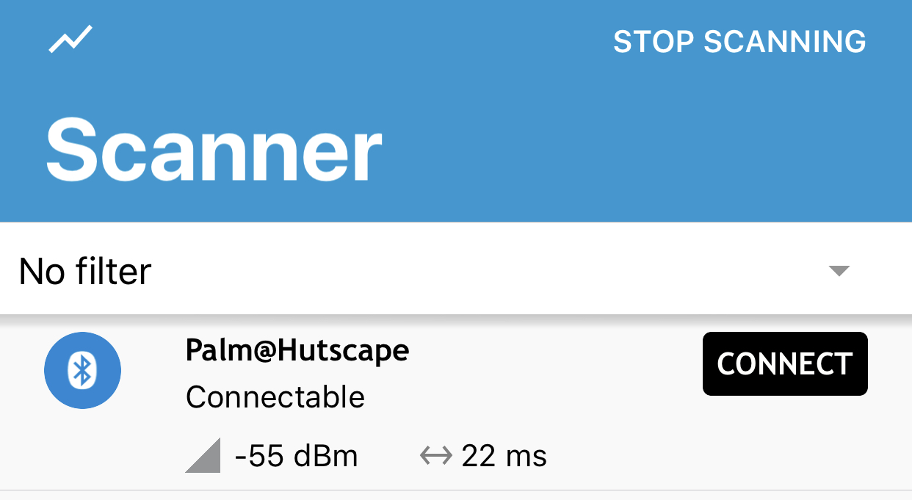
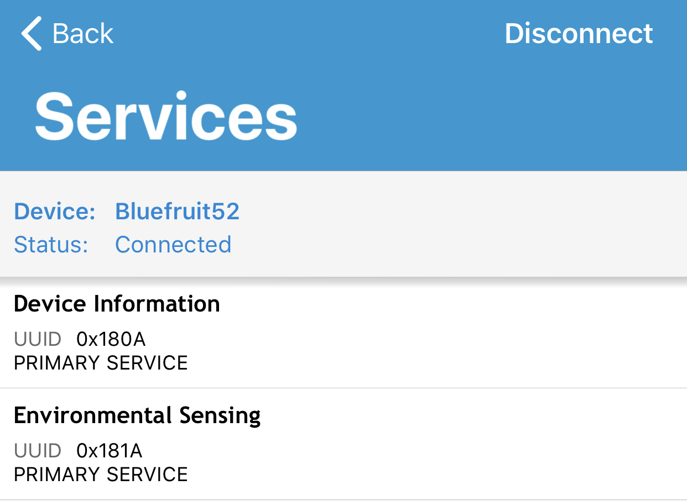
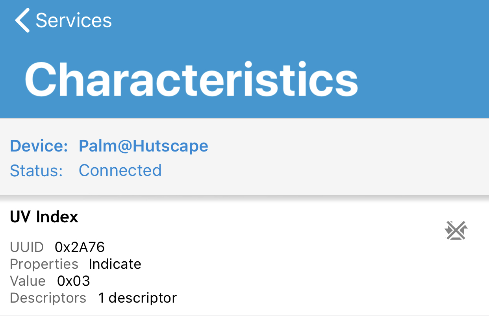

# Palm

> Measure UV index outdoors with a keychain 🗝 hanging on a backpack 🎒. Users can view the current UV index on their mobile app or on-board RGB LED.

- **Wireless:**	BLE
- **Sensors:**	1 (`VEML6075` for UV)
- **Power:**	[LiPo](power.md)
- **Processor:**	`NRF52` on [Adafruit Bluefruit LE](https://www.adafruit.com/product/2661)
- **Modules:** 2 (MCU, sensor)
- **Firmware:**	[Arduino NRF52](https://github.com/sandeepmistry/arduino-nRF5)
- **OTA?**	No
- **Works without connectivity?**	Yes. Display an RGB LED on-board
- **BOM Total Items:**	[11](bill_of_materials.csv)
- **BOM Unique Items:** [8](bill_of_materials.csv)
- **PCB Manufacturing vendor:**	JLCPCB
- **BOM vendors:** [RS Components, Adafruit, AliExpress, JLCPCB](bill_of_materials.csv)
- **Total vendors:** 4
- **Total units:** 1
- **Total cost:** [SGD 64.07](bill_of_materials.csv)
- **Battery life:** *Pending*
- **Total schedule:** 3 months

## Getting Started

1. Wire up the [hardware](hardware) components

    
    
1. Flash the [firmware](firmware/firmware.ino) to display UV Index

    
1. See the UV, temperature and humidity values values being displayed on the [nRF Connect iPhone app](https://itunes.apple.com/sg/app/nrf-connect/id1054362403?mt=8) or the console

    
    
    

## Others

- [Hardware](hardware)
- [Firmware](firmware)
- [Bill of Materials](bill_of_materials.csv)
- [Design](design)
- [Power](power.md)
- [Mechanical](mechanical.md)
- [Schedule](schedule.md)
- [Lessons Learnt](lessons.md)
- [References](references.md)
